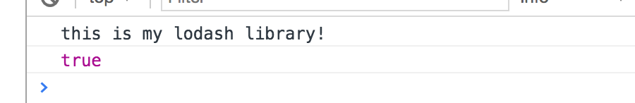

## 从v1迁移到v2

### 1. 配置类型

在webpack1的时候，主要是通过导出单个`object`来进行配置。例如下面的配置：

```javascript
// webpack1 导出方式
module.export = {
  	entry : 'app.js',
  	output : { */... */},
  	/* ... */
};
```

而在webpack2中，则有三种方式来灵活配置，可以针对不同的场景。

#### 1.1 通过不同环境变量导出不同的配置文件

```Javascript
// 可以有两种方式传递当前值，一种是简单传递字符串，另外一种则是传递一个对象
// 例如： webpack --env production 控制台打印的就是 'production'，是一个字符串
// 而当这样调用时：webpack --env.production --env.size 60，控制台打印的就是 { production : true, size : 60 }

var path = require('path'),
	webpack = require('webpack'),
	UglifyJsPlugin = new webpack.optimize.UglifyJsPlugin(),
	plugins = [];

module.exports = function(env) {

  	console.log(env);
  
	if (env === 'production') {
		plugins.push(UglifyJsPlugin);
	}

	return {
		entry : path.resolve(__dirname, 'js/app.js'),
		output : {
			path : path.resolve(__dirname, 'build'),
			filename : '[name].bundle.js'
		},
		module : {
			rules : [
				{ 
					test : /\.js|\.jsx$/, 
					loader : 'babel-loader', 
					options : {
						presets : ["es2015", "react"]
					} 
				},
				{ 
					test : /\.css$/,
					use : ['style-loader', 'css-loader']
				},
				{
					test : /\.less$/,
					use : ['style-loader', 'css-loader', 'less-loader']
				}
			]
		},
		plugins : plugins
	};
}

// 在package.json中配置两个命令
{
  	"dev" : "webpack",
    "build" : "webpack --env production"
}
```

具体的生产环境构建方式可以参看官网[production][https://webpack.js.org/guides/production/]

#### 1.2 通过promise方式导出配置文件

这种方式的应用场景是在某些情况下，我们暂时拿不到配置文件所需要的配置参数，比如需要配置的文件名等等，或许这是一个异步的操作，通过promise方式可以使我们在异步操作之后得到配置变量，然后再执行配置文件。

```javascript
// 在这种情况下，1秒之后会返回配置文件并且执行

var path = require('path');

module.exports = () => {
	return new Promise((resolve, reject) => {
		console.log('loading configuration ...');
		setTimeout(() => {
			console.log('loading completed!');
			resolve({
				entry : path.resolve(__dirname, 'js/app.js'),
				output : {
					path : path.resolve(__dirname, 'build'),
					filename : '[name].bundle.js'
				},
				module : {
					rules : [
						{ 
							test : /\.js|\.jsx$/, 
							loader : 'babel-loader', 
							options : {
								presets : ["es2015", "react"]
							} 
						},
						{ 
							test : /\.css$/,
							use : ['style-loader', 'css-loader']
						},
						{
							test : /\.less$/,
							use : ['style-loader', 'css-loader', 'less-loader']
						}
					]
				},
			});
		}, 1000);
	});
}
```

#### 1.3 同时打包多份配置文件

webpack1时只能导出单份配置文件，在webpack2中可以同时打包多份配置文件，意味着可以为多个入口文件打包，在多页面打包的时候，就再也不需要为在每一个单独的页面执行打包命令了。

```javascript
// config-amd.js
var path = require('path');

module.exports = {
	entry : path.resolve(__dirname, 'js/app.js'),
	output : {
		path : path.resolve(__dirname, 'build'),
		filename : '[name].amd.js',
		libraryTarget : 'amd'
	},
	module : {
		rules : [
			{ 
				test : /\.js|\.jsx$/, 
				loader : 'babel-loader', 
				options : {
					presets : ["es2015", "react"]
				} 
			},
			{ 
				test : /\.css$/,
				use : ['style-loader', 'css-loader']
			},
			{
				test : /\.less$/,
				use : ['style-loader', 'css-loader', 'less-loader']
			}
		]
	}
};

// config-commonjs.js
var path = require('path');

module.exports = {
	entry : path.resolve(__dirname, 'js/app.js'),
	output : {
		path : path.resolve(__dirname, 'build'),
		filename : '[name].commonjs.js',
		libraryTarget : 'commonjs'
	},
	module : {
		rules : [
			{ 
				test : /\.js|\.jsx$/, 
				loader : 'babel-loader', 
				options : {
					presets : ["es2015", "react"]
				} 
			},
			{ 
				test : /\.css$/,
				use : ['style-loader', 'css-loader']
			},
			{
				test : /\.less$/,
				use : ['style-loader', 'css-loader', 'less-loader']
			}
		]
	}
};

// webpack.config.js
var configAmd = require('./config-amd.js'),
	configCommonjs = require('./config-commonjs.js');

module.exports = [
	configAmd,
	configCommonjs
]
```

### 2. resolve相关

#### 2.1 extensions 后缀扩展

在webpack2中，不需要默认写一个空字符串，如果没有配置这个选项，则默认的后缀名是`['.js', '.json']`，这样可以在需要用到`import 'some.js'`的时候直接写`import 'some'`就好。

如果不想开启自动后缀，则需要在`resolve`中配置`enforceExtension : true`，例如：

```javascript
var path = require('path');

module.exports = {
	entry : // ....,
	// ...
	resolve : {
		enforceExtension : true
	}
};
```

此时，如果在`js/app.js`中引用`js/text.js`，就会报错

```javascript
// Error
import './text';

// Right
import './text.js';
```

#### 2.2 root/fallback/modulesDirectories 文件定位

在`webapck1 resolve`中配置这三个属性，是告诉webpack在引入模块的时候必须要寻找的文件夹，webpack2中则直接更换成了一个单独的属性`modules`，默认优先搜索`node_modules`(注意，这是一个相对位置)

```javascript
// config
resolve: {
  	// root : path.join(__dirname, "src")  webpack1方式
  	modules : [
      	path.join(__dirname, "src"),	// 优先于node_modules/搜索
      	"node_modules"
  	]
}

// 修改 js/app.js
// 在js文件夹中，增加一个lodash.js，如果按照上面的配置了modules，则会优先加载我们自己的lodash库
import '../css/style.less';
import _ from 'lodash';

console.log(_.isObject([1, 2, 3]));
document.getElementById('container').textContent = 'APP';

// js/lodash.js
export default {
	isObject(a) {
		console.log('this is my lodash library!');
		return a && typeof a === 'object';
	}
}
```

得到的结果如下图：



### 3. module相关

#### 3.1 module.rules替换module.loaders

> The old loader configuration was superseded by a more powerful rules system, which allows configuration of loaders and more. For compatibility reasons, the old `module.loaders` syntax is still valid and the old names are parsed. The new naming conventions are easier to understand and are a good reason to upgrade the configuration to using `module.rules`.

大意就是新的命名更容易理解(反正对于我来说就是换了个英文单词:-D)，同时还会兼容老的方式，也就是说，你照样写`module.loaders`还是可以的。

```javascript
module : {
  	// webpack1 way
  	// loaders : [...]
  	
  	// now
  	rules : [
      	...
  	]
}
```

3.2 module[*].loader写法

如果需要加载的模块只需要一个`loader`，那么你还是可以直接用`loader`这个关键词；如果要加载的模块需要多个`loader`，那么你需要使用`use`这个关键词，在每个`loader`中都可以配置参数。代码如下：

```javascript
module : {
  	rules : [
      	{ test : /\.js|\.jsx$/, loader : 'babel-loader' },
      
      	/* 如果后面有参数需要传递到当前的loader，则在后面继续加上options关键词，例如：
          { 
            test : /\.js|\.jsx$/, 
            loader : 'babel-loader', 
            options : { presets : [ 'es2015', 'react' ] } 
          }
        */
      
      	{
          	test : /\.css$/,
          	// webpack1 way
          	// loader : 'style!css'
          
          	use : [ 'style-loader', 'css-loader' ]
      	},
      	{
          	test : /\.less$/,
          	use : [
              	'style-loader',		// 默认相当于 { loader : 'style-loader' }
              	{
                  	loader : 'css-loader',
                  	options : {
                      	modules : true
                  	}
              	},
              	'less-loader'
          	]
      	}
  	]
}
```

#### 3.2 取消自动添加`-loader`后缀

之前写loader通常是这样的：

```javascript
loader : 'style!css!less'
// equals to
loader : 'style-loader!css-loader!less-loader'
```

都自动添加了`-loader`后缀，在webpack2中不再自动添加，如果需要保持和webpack1相同的方式，可以在配置中添加一个属性，如下：

```javascript
module.exports = {
  	...
  	resolveLoader : {
      	moduleExtensions : ["-loader"]
  	}
}

// 然后就可以继续这样写，但是官方并推荐这样写
// 不推荐的原因主要就是为了照顾新手，直接写会让刚接触的童鞋感到困惑
// github.com/webpack/webpack/issues/2986
use : [ 'style', 'css', 'less' ]
```

#### 3.3 json-loader内置啦

如果要加载`json`文件的童鞋再也不需要配置`json-loader`了，因为webpack2已经内置了。

### 4. plugins相关

#### 4.1 UglifyJsPlugin 代码压缩插件

压缩插件中的`warnings`和`sourceMap`不再默认为true，如果要开启，可以这样配置

```javascript
plugins : [
  	new UglifyJsPlugin({
      	souceMap : true,
      	warnings : true
  	})
]
```

#### 4.2 ExtractTextWebapckPlugin 文本提取插件

主要是写法上的变动，要和webpack2配合使用的话，需要使用version 2版本

```javascript
// webpack1 way
modules : {
  	loaders : [
      	{ 
          	test : /\.css$/, 
          	loader : ExtractTextPlugin.extract('style-loader', 'css-loader', { publicPath : '/dist' })
        }	
  	]
},
plugins : [
  	new ExtractTextPlugin('bunlde.css', { allChunks : true, disable : false })
]

// webapck2 way
modules : {
  	rules : [
      	{ 
          	test : /\.css$/, 
          	use : ExtractTextPlugin.extract({
              	fallback : 'style-loader',
              	use : 'css-loader',
              	publicPath : '/dist'
          	})
        }
  	]
},
plugins : [
  	new ExtractTextPlugin({
      	filename : 'bundle.css',
      	disable : false,
      	allChunks : true
  	})
]

```

### 5. loaders的debug模式

在webpack1中要开启loaders的调试模式，需要加载`debug`选项，在webpack2中不再使用，在webpack3或者之后会被删除。如果你想继续使用，那么请使用以下写法：

```javascript
// webpack1 way
debug : true

// webapck2 way 
// webapck2将loader调试移到了一个插件中
plugins : [
  	new webpack.LoaderOptionsPlugin({
      	debug : true
  	})
]
```

### 6. 按需加载方式更改

#### 6.1 import()方式

在webpack1中，如果要按需加载一个模块，可以使用`require.ensure([], callback)`方式，在webpack2中，ES2015 loader定义了一个`import()`方法来代替之前的写法，这个方法会返回一个promise.

```javascript
// 在js目录中新增一个main.js
// js/main.js
console.log('main.js');

// webpack1 way
require.ensure([], function(require) {
	var _ = require('./lodash').default;
	console.log(_);
	console.log('require ensure');
	console.log(_.isObject(1));
});

// webpack2 way
// 采用这种方式，需要promise 的 polyfill
// 两种方式：
// 1. npm install es6-promise --save-dev
//	  require('es6-promise').polyfill();
//
// 2. babel方式，在webpack中配置babel插件
// 	  npm install babel-syntax-dynamic-import --save-dev
// 	  options : {
//        presets : ['es2015'],
//	      plugins : ['syntax-dynamic-import']
//    }
import('./lodash').then(module => {
	let _ = module.default;
	console.log(_);
	console.log('require ensure');
	console.log(_.isObject(1));
});
```

会得到的chunk文件，如下图：


#### 6.2 动态表达式

可以动态的传递参数来加载你需要的模块，例如：

```javascript
function route(path, query) {
  	return import(`./routes/${ path }/route`)
    	.then(route => { ... })
}
```

### 7. 热替换更加简单

webpack2中提供了一种更简单的使用热替换功能的方法。当然如果要用node启动热替换功能，依然可以按照webpack1中的方式。

```javascript
npm install webpack-dev-server --save-dev

// webpack.config.js
module.exports = {
  	// ...,
  	devServer : {
		contentBase : path.join(__dirname, 'build'),
		hot : true,
		compress : true,
		port : 8080,
		publicPath : '/build/'
	},
  	plugins : [
      	new webpack.HotModuleReplacementPlugin()
  	]
}
```

## 谈谈V2版本

主要是介绍之前在webpack1中忽略的以及v2版本中新加的一些东西。

### 1. caching（缓存）

浏览器为了不重复加载相同的资源，因此加入了缓存功能。通常如果请求的文件名没有变的话，浏览器就认为你请求了相同的资源，因此加载的文件就是从缓存里面拿取的，这样就会造成一个问题，实际上确实你的文件内容变了，但是文件名没有变化，这样还是从缓存中加载文件的话，就出事了。

那么，之前传统的做法就是给每个文件打上加上版本号，例如这样：

```javascript
app.js?version=1
app.css?version=1
```

每次变动的时候就给当前的版本号加1，但是如果每次只有一个文件内容变化就要更新所有的版本号，那么没有改变的文件对于浏览器来说，缓存就失效了，需要重新加载，这样就很浪费了。那么，结合数据摘要算法，版本号根据文件内容生成，那么现在的版本可能是这样的。

```javascript
// before
app.js?version=0add34
app.css?version=1ef4a2

// after
// change app.js content
app.js?versoin=2eda1c
app.css?version=1ef4a2
```

关于怎么部署前端代码，可以查看[大公司怎样开发和部署前端代码](github.com/fouber/blog/issues/6)

webpack为我们提供了更简单的方式，为每个文件生成唯一的哈希值。为了找到对应的入口文件对应的版本号，我们需要获取统计信息，例如这样的：

```javascript
{
  "main.js": "main.facdf96690cca2fec8d1.js",
  "vendor.js": "vendor.f4ba2179a28531d3cec5.js"
}
```

同时，我们结合`html-webpack-plugin`使用的话，就不需要这么麻烦，他会自动给文件带上对应的版本。具体看法参看之前写的[webpack1知识梳理](https://github.com/Rynxiao/webpack-tutorial)，那么我们现在的配置变成了这个样子：

```javascript
npm install webpack-manifest-plugin --save-dev

// webpack.config.js
module.exports = {
	entry : { /* ... */ },
	output : {
		path : path.resolve(__dirname, 'build-init'),
		filename : '[name].[chunkhash].js',
		chunkFilename : '[name].[chunkhash].js'
	},
	module : {
		// ...
	},
	plugins : [
		new htmlWebpackPlugin({
			title : 'webpack caching'
		}),
		new WebpackManifestPlugin()
	]
}
```

html引入情况

```html
<!DOCTYPE html>
<html>
  <head>
    <meta charset="UTF-8">
    <title>webpack caching</title>
  </head>
  <body>
  <div id="container"></div>
  <script type="text/javascript" src="main.facdf96690cca2fec8d1.js"></script><script type="text/javascript" src="vendor.f4ba2179a28531d3cec5.js"></script></body>
</html>
```

> WARNNING：
>
> 不要在开发环境下使用[chunkhash]，因为这会增加编译时间。将开发和生产模式的配置分开，并在开发模式中使用[name].js的文件名，在生产模式中使用[name].[chunkhash].js文件名。

为了使**文件更小化**，webpack使用标识符而不是模块名称，在编译的时候会生成一个名字为manifest的chunk块，并且会被放入到entry中。那么当我们更新了部分内容的时候，由于hash值得变化，会引起manifest块文件重新生成，这样就达不到长期缓存的目的了。webpack提供了一个插件`ChunkManifestWebpackPlugin`,它会将manifest映射提取到一个单独的json文件中，这样在manifest块中只需要引用而不需要重新生成，所以最终的配置是这样的：

```javascript
var path = require('path'),
	webpack = require('webpack'),
	htmlWebpackPlugin = require('html-webpack-plugin'),
	ChunkManifestWebpackPlugin = require('chunk-manifest-webpack-plugin'),
	WebpackChunkHash = require('webpack-chunk-hash');

module.exports = {
	entry : {
		main : path.resolve(__dirname, 'js/app.js'),
		vendor : path.resolve(__dirname, 'js/vendor.js')
	},
	output : {
		path : path.resolve(__dirname, 'build'),
		filename : '[name].[chunkhash].js',
		chunkFilename : '[name].[chunkhash].js'
	},
	module : {
		// ...
	},
	plugins : [
		new webpack.optimize.CommonsChunkPlugin({
			name : ['vendor', 'manifest'],
			minChunks : Infinity
		}),
		new webpack.HashedModuleIdsPlugin(),
		new WebpackChunkHash(),
		new htmlWebpackPlugin({
			title : 'webpack caching'
		}),
		new ChunkManifestWebpackPlugin({
			filename : 'chunk-mainfest.json',
			manifestVariable : 'webpackManifest',
			inlineManifest : true
		})
	]
}
```

tips：如果还不是很明白，去对比一下加了`ChunkManifestWebpackPlugin`和没加的区别就可以清楚的感受到了。在本文的代码文件夹`caching`中可以看到这一差别

